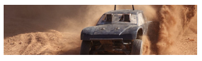
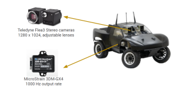
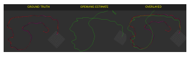
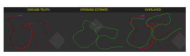
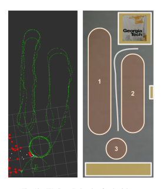

# 🚗 Visual Inertial Odometry Based State Estimation For Autorally / Racecar

Detailed Report can be found [here](Report)

## 🌟 Overview

This project aims to enhance localization for autorally and racecar testbed environments using visual-inertial odometry (VIO) by combining RGB camera data with IMU data. The integrated approach offers improved accuracy and robustness in diverse conditions, overcoming limitations of traditional GNSS and IMU-only methods.
📖 Introduction

The rapid advancements in autonomous vehicle technology promise significant impacts across various industries. Achieving fully autonomous driving requires robust solutions to numerous challenges, including reliable localization, essential for autonomous navigation.

## 🎯 Project Goals

    Develop a VIO system integrating visual and inertial data.
    Enhance localization accuracy in autonomous racing environments.
    Address challenges posed by different environmental conditions.

## 🔧 Methodology

    📸 Hardware Calibration: Calibrate RGB cameras and IMU sensors to fit VIO algorithms.
    🧠 Algorithm Benchmarking: Combine sensor data to estimate vehicle state.
    🧪 Testing and Validation: Implement and test the system in simulated and real-world environments.

## 📊 Results

The proposed VIO system demonstrated improved localization accuracy compared to GNSS and IMU-only approaches. It performed well in various test scenarios, indicating its potential for real-world applications.

## 🏁 Conclusion

The VIO system offers a robust solution for autonomous vehicle localization, effectively addressing the limitations of traditional methods. Future work includes further optimization and testing in more diverse environments.

## 👥 Contributors

    Bhushan Pawaskar, School of Aerospace Engineering, Georgia Institute of Technology.

## 📬 Contact

    Email: bpawaskar3@gatech.edu
