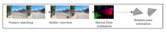

# Visual Inertial Odometry Based State Estimation For Autorally / Racecar

Report for Capstone Project - AE8900 Bhushan Pawaskar,School of Aerospace Engineering Georgia Institute of Technology Atlanta, United States bpawaskar3@gatech.edu

Abstract **—This project focuses on the task of localization for**
the autorally and racecar testbed environments using visual camera data. Traditional methods, like Global Navigation Satellite Systems (GNSS) have limitations, such as signal interference whereas IMU based estimation methods suffer from lots of noise in data collected at source. The project proposes a Visual-Inertial Odometry (VIO) System that combines the information from rich RGB camera data with IMU data, aiming to enhance localization accuracy and address challenges posed by diverse environmental conditions. This integrated approach seeks to provide a robust solution for autonomous navigation and exploration without relying on external GPS data.

## I. Introduction

The autonomous vehicle industry has seen a lot of growth in recent years, with rapid advancements in robotics technologies. Self-driving technology has the potential to not only revolutionize the transportation industry but can also make a significant impact in agriculture, search and rescue operations. However, for a vehicle to attain fully automated level 5 autonomous driving status, there are still many issues that need to be addressed. Such a vehicle should be able to autonomously operate in all situations and should be robust to all types of conditions. In order to achieve this kind of robustness for an autonomous robot, the challenges are multifold and vary across various sub-tasks from perception to localization to mapping.

Estimating its current state in the environment is one such task which is crucial for a robot to navigate its surrounding regions. This process of estimating the 'local state' is termed as localization. Even when a map of the environment is available, localization is essential for as it helps incorporate a closed-loop feedback of the changes in the robot's local environment. Mapping and planning allows a robot to build a map of its surroundings and then plan efficient paths as per certain objectives. Without accurate localization however, a robot cannot determine its position relative to other objects in the environment. Thus, it would not be able to plan a trajectory without any information about its location on the map. It is especially important for autonomous exploration of unknown environments.

Localization is a challenging problem and is typically tackled using measurements from a wide range of sensor suites from wheel-speed sensors, inertial measurements units (IMU) to cameras and also global navigation satellite systems
(GNSS). Even though IMU based inertial odometry methods can provide decent estimates of acceleration and velocities, their accuracy in determining position is limited. Moreover, the errors for these systems can accumulate over time which is undesirable and needs correction. Methods based on GNSS
can have very high accuracy, especially with the rapid development of Global Positioning System (GPS) technologies like Real-time Kinematic (RTK). These have allowed for position estimates with a decimeter or centimeter level of accuracy.

However, GNSS based methods suffer from signal interference in noisy signal environments. Also, they suffer from signal blockage in indoor or other GNSS denied areas which makes them unreliable in such environments.

Fig. 1. Autorally testbed Vision based navigation systems on the other hand approach this problem by using visual sensors like Light Detection and Ranging (LIDAR) and cameras. These systems process raw point cloud or image data to extract the robot's positional and rotational information with respect to its surroundings.

Visual odometry (VO) is one such method that tracks features between camera images at different time instants to estimate the position and translation of the robot between such instances. Raw image data obtained from a camera can contain lots of meaningful data like shape, color or texture to aid in the estimation of motion parameters. However, in low light conditions or harsh environments like in rainy weather for example, camera data becomes less useful leading to a degradation of performance of VO systems. But, these conditions do not affect IMU measurements. Thus, we can combine VO systems with inertial odometry methods and address the limitations of each of these by supplementing them with each other's data. Such a system is termed as VisualInertial Odometry (VIO) System.

## II. Literature Review

### A. Structure From Motion (SFM)

The problem of recovering relative camera poses and threedimensional (3-D) structure from a set of camera images is known as Structure from Motion (SFM). Much of the initial work related to VIO systems can be attributed to the developments in SFM algorithms in the 1980s. [1] [2] [3]. SFM deals with the challenge of reconstructing both the 3D layout of a scene and the positions of cameras capturing it, using a sequence of images, which can be in any order.

This process often involves an optimization problem of the obtained scene and camera information using a comprehensive adjustment (bundle adjustment) that becomes slower as more images are used.

In 1981, Longuet-Higgins et al [1] was one of the initial works that focused on extracting 3d information from 2d images. Later, Baker et al [2] tried to extract depth information by focusing on the integration of edge and intensity cues for improved accuracy and robustness. While, Arnold et al
[3] attempted to do it by matching features like extended edges and also automated the process. Anandan et al [4]
introduced a computational framework for measuring visual motion, reflecting a growing emphasis on motion estimation as an integral part of SFM. Harris et al [5] explored methods for integrating motion information from image sequences to improve the accuracy and robustness of 3D reconstruction. This shift enabled the reconstruction of dynamic environments by accounting for motion cues alongside depth information.

This type of analysis falls into the domain of Visual Odometry
(VO): determining the ego-motion of an agent by analyzing the input from one or more cameras that are connected to it.

## B. Visual Odometry (VO)

Visual Odometry (VO) can be seen as a specific subset of SFM. VO concentrates on sequential data: it aims to estimate the camera's 3D movement in real-time, as new frames of an image sequence arrive. VO doesn't handle the complete scene reconstruction like SFM does; instead, it focuses on tracking the camera's motion as it navigates through the environment.

The local estimation of this motion can be improved using techniques similar to bundle adjustment to enhance accuracy.

Broadly speaking, VO can be classified into either appearance based or feature based systems. They can also be broken down into stereo VO and monocular VO. While stereo VO
offers depth estimation, stereo VO reduces to a monocular VO when the distance to the scene becomes much greater than the distance between the cameras. Thus, both of these lines of research have their own merits.

1) Stereo VO:

Much of development for stereo VO systems was driven by NASA's Mars exploration [6] [7] [8], focused on equipping planetary rovers to estimate 6-DoF motion in challenging terrains. Stereo cameras were often used with corner detection algorithms; Matthies et al [7] [8]
built upon Moravec's [6] corner detection, using binocular systems and incorporating error covariance matrices for motion estimation, achieving improved trajectory recovery. Olson et al [9], [10] introduced an absolute orientation sensor and improved corner detection, significantly reducing accumulation errors in camera egomotion estimates. The inclusion of an absolute orientation sensor yielded a lower position error of for longer paths. Most of these earlier works used triangulation of tracked features across frames in 3d space to estimate motion. However, the term 'Visual Odometry' came to be coined much later in 2004 by Nister [11]. This paper detected features in frames independently and matched them later. This allowed them to address challenges like handling occlusions, outliers, and camera rotations, and incorporate robust statistical techniques like RANSAC
[12] to enhance the accuracy and reliability of the motion estimation process.

2) Monocular VO:

Since there is no 3d information, all the estimations in mono VO must be done on the 2d bearing data. These methods track either features over a set of frames or use intensity information (appearance based) in the sub-regions of the image. Nister et al [11] gave one of the first real time implementations of VO using a single camera. It used a 5 point minimal solver [17]
with RANSAC [12]. This method became popular and was then adopted to omni-directional cameras as well
[16] [13]. As for the appearance based methods, Goecke et al [14] employed the Fourier-Mellin transform for registering ground plane images captured from a car. Milford and Wyeth [15] extracted rotational and translational velocity information from a single car-mounted camera. These were however, not robust to occlusions.

VO works by incrementally estimating postion after each frame. This causes errors to accumulate over time and causes the results to drift. This can be reduced by locally optimizing over the last k frames. This approach is known as sliding window bundle adjustment. [20] [21]. Apart from this if we use additional measurements from sensors like GPS or IMU,
the drift can be reduced further. Thus, making Visual Inertial Odometry (VIO) much more superior in comparison.

### C. Visual Inertial Odometry (Vio)

IMU provides highly accurate data at a high rate. But the data is often prone to lots of noise. As a result, long term estimation of state by integrating IMU measurements leads to a lot of drifting. Combining it with VO however, overcomes this limitation thus giving a reliable system for localization.

VIO systems have come a long way since Tardif et al [24].

Apart from the classifications of VO subsystems in VIO,
these can be classified in multiple ways based on how loosely the sensor data is coupled from loosely coupled [22] [23]
where each sensor individually estimates the state to being tightly coupled using a Multi State constraint Kalman Fliter
(MSCKF) [25]. In coupled systems, a filter based: two step approach (IMU estimation, then vision estimator) could be taken using Extended Kalman Filters (EKF) or MSCKF [25]. Or an optimization based approach [39] [38] which solves the non-linear least squares problem over the imu and camera data.

## III. METHODOLOGY

### A. Hardware Calibration

In order to perform state estimation using hardware readings, the theoretical perfection of simulated models must account for the real-world imperfections inherent in physical hardware. This necessitates calibration, a critical process to rectify discrepancies between idealized assumptions and the actual hardware. For instance, camera models have reprojection and distortion errors, requiring adjustment of intrinsic parameters for accurate representation. Similarly, Inertial Measurement Units (IMUs) contend with noise, necessitating calibration to mitigate constant bias and additive white noise for gyroscope and accelerometer readings. Further, the functionality of both camera and IMU demands estimation of their relative transformations, Thus, hardware calibration is

important to the ensure accuracy of the state estimation system.

#### 1) Camera Calibration:

VO can be done with perspective, omni-directional as well as spherical cameras. However, since Autorally uses perspective based cameras so we use a pinholde camera model with radial and tangential distortions incorporated in it. Pinhole camera model is the most commonly used model for perspective cameras. It describes how a 3D scene is projected onto a 2D image plane using a simplified camera representation.

In the pinhole camera model: [18] [19]
a) Camera Center (or Optical Center): This is the point in space where all the rays of light entering the camera converge. It is typically denoted as the origin of the camera's coordinate system.

b) Image Plane: This is a 2D plane situated perpendicular to the camera's optical axis and placed at a certain distance from the camera center.

c) Principal Point: The point where the optical axis intersects the image plane. It's often denoted by the coordinates (u0, v0), representing the center of the image.

d) Focal Length (f): The distance between the camera center and the image plane, along the optical axis.

It defines the magnification of the scene.

The images co-ordinates u, v can be obtained by the equation shown below. The 4 parameters in the projection matrix αu, αv, u0, v0 are called camera intrinsic parameters and differ for each camera. Every camera must be calibrated to find these projection parameters.

Apart from these, if the camera field of view is high, then the camera also suffers from distortions. These could be either radial or tangential distortions. Distortion effects need to be corrected for and can be modelled using a second (or higher) order polynomial.
Given, coordinates: X = [*x, y, z*]
projection: P = [*u, v*]
focal lengths: αu, αv projection center: u0, v0

$$K X=\lambda P$$
$${\left[\begin{matrix}\alpha_{u}&0&u_{0}\\ 0&\alpha_{v}&v_{0}\\ 0&0&1\end{matrix}\right]}\,{\left[\begin{matrix}x\\ y\\ z\end{matrix}\right]}=\lambda\,{\left[\begin{matrix}u\\ v\\ 1\end{matrix}\right]}$$

The calibration step is done using a checkerboard or an Aruco markers as target. Capturing the target board from multiple angles gives us an estimate for what the actual projection matrix and distortion coefficients are.

#### 2) Imu Calibration:

The IMU noise must be accounted for during the calibration stage. This can be either obtained from the manufacturer's data-sheet or it can be calibrated using other tools which use the Allan-Variance method [36]
The IMU measurement tool used was Allan-Variance ROS and it estimates two types of sensor errors: n, an additive noise term that fluctuates very rapidly ("white noise"), and b, a slowly varying sensor bias. The angular rate measurement ω˜ (for one single axis of the gyro, in this case) is therefore written as:

#### Ω˜(T) = Ω(T) + B(T) + N(T)

The same model is independently used to model all three sensor axes as well as to model the accelerometer measurement errors (on each axis independently) [36], [37].

In order to do this, the platform must be kept stationary in one place for 3-4 hours - long enough to record stationary IMU noise. The tool uses this data to compute the Angle Random Walk (ARW), Bias Instability and Gyro Random Walk for the gyroscope as well as Velocity Random Walk (VRW), Bias Instability and Accel Random Walk for the accelerometer.

### B. Problem Definition

Consider a discretized system, with n time steps from start step t1 to current step tn. We consider the problem of estimating the camera trajectory from step t1 to step tn taken by the camera. Let the trajectory of the camera be demonstrated by n different camera poses at each time step such that the camera pose at time step tk is Ck.

Trajectory of camera: τ ≡ [C1, C2*, ......, C*n]
At every step tk, new images i(*lef t*)k and i(*right*)k are obtained. Let the IMU readings from the start of step tk−1 to step tk be denoted by vk.

Let Rk,k−1 be the rotation matrix from step k − 1 to step k and tk,k−1 be the translation matrix from step k − 1 to step k. Let Tk,k−1 be the transformation matrix from camera pose Ck−1 to Ck Given: vk, i(lef t)k, i(right)k, i(lef t)k−1, i(*right*)k−1 Our problem reduces down to finding a transformation matrix from step k−1 to step k, Tk,k−1 ∈ R4 of the following form:

$$\begin{bmatrix}R_{k,k-1}&t_{k,k-1}\\ 0&1\end{bmatrix}$$

Finding Tk,k−1 for all time steps from t1 to tn will lead to generation of all poses C1 to Cn and thus in turn τ ≡
[C1, C2*, ......, C*n]

### C. Vio Frameworks

The general workflow of a VIO system is as shown here.

Common features between two frames are detected using feature detectors like ORB, SIFT, KLT. Then using an algorithm like RANSAC, outlier false matches are rejected. Based on the matched features, optical flow estimation from the frames is done. Relative poses between the two frames is computed from this data.

Based on criteria like active library support, availability of ROS wrappers, and stereo camera compatibility, four different VIO packages were chosen to be tested. The plan involved benchmarking these selected packages to determine their performance and identify the most suitable one for the autorally system.

1) Orbslam3 [41]
2) OpenVINS [42]
3) ROVIOLI [43]
4) Xivo [44]

These can be divided into two categories primarily based on how they perform the optimization step. This also affects their computation time significantly. These are Optimization-based and Filter-based approaches.

1) **Filter based:** These methods employ a sequential approach to updating the estimate, first utilizing inertial information, followed by visual data, and then incorporating inertial measurements again. The Extended Kalman Filter is employed to iteratively refine the estimate based on the previous estimate and new measurements. **Rovioli**
and **Xivo** followed this approach.

2) **Optimization-based:** This approach involves optimizing the estimate by jointly considering information from both IMU and camera data, seeking to minimize the overall least squares error of the estimate through nonlinear optimization. This makes the approach more accurate at the cost of being computationally expensive.

Orbslam3 and **OpenVins** followed this approach

## IV. Results 

### A. Hardware Calibration 

#### 1) Camera Calibration:

Kalibr was vital for estimating the projection as well as distortion coefficients. Kalibr was also used again to compute relative transformations between the stereo cameras and IMU.

For the camera intrinsics, the re-projection error with the estimated parameters was within 1 pixel. The reprojection errors are as shown here.

#### 2) Imu Calibration:

Allan Variance ROS gave a reasonable estimate for IMU intrinsics. By plotting the IMU noise data on a logarithmic scale, noise parameters can be estimated using Allan Variance method. The graph for gyro and accelerometer was as follows:

The values estimated were off from the values in the manufacturer data-sheet. Thus, it was worthwhile to perform the calibration to get more accurate estimate of the white noise.

### B. Preliminary Results

The initial results were tested on two bag files of track run to get a visual estimate of how well the estimates were out of the box for the four packages.

Unfortunately, the results were disappointing with the estimates only being accurate for 1-2 packages and even they were only able to estimate it for the initial 10 seconds after which the results looked random.

The best results out of the 4 packages were from Rovioli and Openvins. They managed to estimate the general shape of the initial trajectory. Xivo was completely inaccurate with the estimate jumping all over the place. Orbslam3 on the other hand failed to provide any estimate as it was not able to find more than 10 matching features across two consecutive frames.

The two main probable reasons behind bad estimates could be summarized as follows:

1) **Lighting variations:** Many of these packages were variant to environment lighting conditions and thus needed some kind of pre-filtering in order to track the features well. The variation in exposure caused certain areas of the image to clip (example: when the camera was directly facing the sun causing a sudden change in exposure) where the feature trackers were not able to detect any features.

2) **Noisy Compressed Data** The vehicle movement was extremely erratic. This coupled with image compression led to all information being lost from the grass texture underneath. These points were still being tracked which could have been giving bad results. On probing further, it was found that the points on the chassis of the vehicle were being tracked. This was bound to give a wrong estimate.

### C. Refining Results

1) Image Preprocessing This step involved tweaking image exposure, contrast before passing the images into the estimator. Some of these packages had preprocessing built in which made it a lot easier. Brightness, Contrast, Sharpness, applying grayscale filters were some of preprocessing techniques used. These did not improve the results much. Histogram equalization methods like CLAHE were also used which did show noticeable improvement in result consistency.

2) Masking Vehicle Chassis As some features on the vehicle body were being tracked, an alpha mask was used to exclude such parts from the feature tracker. It was expected that this would make the tracking significantly better. On the contrary, this made the results even worse. As a result, it was decided not to use image masks.

3) Tuning Algorithm Parameters Not all packages, gave complete control over their internal parameters, but some like OpenVins did allow for variation over a number of factors. This step involved varying the values for parameters like feature tracking parameters like number of features to track, what kind of feature tracker to use (with their own parameters), whether to use outlier rejection like RANSAC, what thresholds to use and so on. Along with these, there were other numerical solver parameters, like what solver to use for integration, or whether to use first-estimate jacobians. Testing every possible combination was intractable, so this step had lots of manual iterations adjusting parameters in a first pass to see what improved the estimate. Then, revisiting the parameters in a second pass and refining them once all parameters were adjust initially.

### D. Autorally Results

After a lot of parameter tuning, the results were resembling the ground truth trajectory. Although they were not too promising, as the estimate obtained couldn't really be used as a robust state estimator.

Fig. 14. OpenVins Estimate 1

The best results were obtained with OpenVins. The rest of the packages failed to give decent results. Even with OpenVins, the errors kept on accumulating and eventually after a long time the estimates starts to diverge. Although this is an inherent flaw with VIO based estimation, the error is considerably high that the estimation cannot be used reliably in real time.

Here are some insights on why the results were bad: 1) The data was extremely noisy: due to erratic movements over grass/soil + compression artifacts (bag files have compressed images). This makes it super difficult to have reliable tracking points.

2) Robust descriptor-based trackers like ORB, Fast were performing worse than using something basic KLT
tracker. Infact, the results shown here are with KLT tracker. This is likely related to the fact that large intensity-based changes were a more reliable indicator of motion rather than finding structure based features in the noisy images.

3) Using image masking and histograms for tuning the images actually worsened the performance. This was possibly because an excessive number of features were being tracked due to reduction in the space being tracked, but varying the number of trackers/state estimators after masking, did not improve the estimate.

## E. Race-Car Results

In order to make the problem slightly easier, we decided to switch to the MIT race-car platform which could be used indoors. Tracking features indoors was relatively easier due to consistent lighting conditions and easy to detect high contrast features present in indoor environments.

The race-car platform had similar hardware, a stereo camera pair and an IMU which made it easier to repeat the familiar procedure on the newer hardware. The only major caveat was this was based on the ROS2 Eloquent platform so finding compatible VIO frameworks was a challenge.

Hardware Calibration was done similarly as previously mentioned for Autorally. Luckily, OpenVins which was already giving decent estimates had a ROS2 wrapper. This made for an easy transition to the race-car platform. Some initial bag files were recorded in the hallway which showed promising results. Although, it should be noted that there was no way to verify these results with the ground truth as GPS connectivity is poor indoors. F. IFL Testing

To validate the robustness of these results, subsequent testing was done in Georgia Tech's Indoor Flight Laboratory
(IFL). It is an open indoor space with its own independent Vicon motion-capture system altogether totaling 56 cameras.

This helped with real time validation of the algorithm. The algorithm was running on a single thread with minimal processing overhead.

Since the motion-capture was not available, it was decided that the results would be validated by making the car follow fixed known trajectories to see how well the estimation algorithm performed. Two oval tracks and a circular track was made in the IFL space. The following loops were performed on these in that order:
1) Loop 1: 3 rounds
2) Loop 2: 2 Rounds
3) Loop 3: 5 Rounds

It should be noted here that loops 1 & 2 had some inconsistencies in navigating due to manual control of the vehicle. The overall duration of this test was over 4 minutes. The algorithm did pretty well and the accumulated error was pretty minimal.

Overall, the results were consistent with themselves.

## V. Conclusion

It was shown that using OpenVins, robust state estimation can be done in an indoor environment for Autorally and Racecar testbed. This can be used where GNSS based localization is not available or LIDAR based estimates are infeasible.

Qunatitative validation of the system is yet to be done.

This can be done using a motion capture system or by simultaneously running a LIDAR based SLAM. The VIO
system can be improved further in future using better more robust feature descriptors rather than relying on KLT based detection. Loop closures can also help improve accuracy over long time durations significantly.

## VI. References

[1] H. Longuet-Higgins, "A computer algorithm for reconstructing a scene from two projections," Nature, vol. 293, pp. 133-135, 1981. [Online]. Available: https://doi.org/10.1038/293133a0
[2] H. Baker and T. Binford, "Depth from edge and intensity based stereo," in Proceedings of the International Joint Conference on Artificial Intelligence (IJCAI), 1981, pp. 631-636.

[3] R. D. Arnold, "Automated stereo perception," Artificial Intelligence Laboratory, Stanford University, Tech. Rep. AIM-351, 1983.

[4] P. Anandan, "A computational framework and an algorithm for the measurement of visual motion," International Journal of Computer Vision, vol. 2, no. 3, pp. 283-310, 1989.

[5] C. Harris and J. Pike, "3D positional integration from image sequences,"
in Proceedings of the Alvey Vision Conference, 1988, pp. 87-90.

[6] H. Moravec, "Obstacle avoidance and navigation in the real world by a seeing robot rover," Ph.D. dissertation, Stanford University, Stanford, CA, 1980.

[7] L. Matthies and S. Shafer, "Error modeling in stereo navigation," IEEE
Journal of Robotics and Automation, vol. 3, no. 3, pp. 239-248, 1987.

[8] L. Matthies, "Dynamic stereo vision," Ph.D. dissertation, Carnegie Mellon University, Pittsburgh, PA, 1989.

[9] C. Olson, L. Matthies, M. Schoppers, and M. W. Maimone, "Robust stereo ego-motion for long distance navigation," in Proceedings of the IEEE Conference on Computer Vision and Pattern Recognition (CVPR), 2000, pp. 453-458.

[10] C. Olson, L. Matthies, M. Schoppers, and M. Maimone, "Rover navigation using stereo ego-motion," Robotics and Autonomous Systems, vol.

43, no. 4, pp. 215-229, 2003.

[11] D. Nister, O. Naroditsky, and J. Bergen, "Visual odometry," in Proceedings of the International Conference on Computer Vision and Pattern Recognition (CVPR), 2004, pp. 652-659.

[12] M. A. Fischler and R. C. Bolles, "Random sample consensus: A
paradigm for model fitting with applications to image analysis and automated cartography," Communications of the ACM, vol. 24, no. 6, pp. 381-395, 1981.

[13] J.-P. Tardif, Y. Pavlidis, and K. Daniilidis, "Monocular visual odometry in urban environments using an omnidirectional camera," in Proceedings of the IEEE/RSJ International Conference on Intelligent Robots and Systems (IROS), 2008, pp. 2531-2538.

[14] R. Goecke, A. Asthana, N. Pettersson, and L. Petersson, "Visual vehicle egomotion estimation using the Fourier-Mellin transform," in Proceedings of the IEEE Intelligent Vehicles Symposium, 2007, pp. 450-455.

[15] M. J. Milford and G. Wyeth, "Single camera vision-only SLAM on a suburban road network," in Proceedings of the IEEE International Conference on Robotics and Automation (ICRA), 2008, pp. 3684-3689.

[16] P. I. Corke, D. Strelow, and S. Singh, "Omnidirectional visual odometry for a planetary rover," in Proceedings of the IEEE/RSJ International Conference on Intelligent Robots and Systems (IROS), 2005, pp. 40074012.

[17] D. Nister, "An efficient solution to the five-point relative pose problem,"
in Proceedings of the International Conference on Computer Vision and Pattern Recognition (CVPR), 2003, pp. 195-202.

[18] R. Hartley and A. Zisserman, Multiple View Geometry in Computer Vision, 2nd ed. Cambridge University Press, 2004.

[19] Y. Ma, S. Soatto, J. Kosecka, and S. Sastry, An Invitation to 3D Vision, from Images to Models. Springer-Verlag, Berlin, 2003.

[20] F. Fraundorfer, D. Scaramuzza, and M. Pollefeys, "A constricted bundle adjustment parameterization for relative scale estimation in visual odometry," in Proceedings of the IEEE International Conference on Robotics and Automation (ICRA), 2010, pp. 1899-1904.

[21] N. Sunderhauf, K. Konolige, S. Lacroix, and P. Protzel, "Visual odometry using sparse bundle adjustment on an autonomous outdoor vehicle,"
in Tagungsband Autonome Mobile Systeme, Reihe Informatik aktuell, P. Levi et al., Eds. Springer-Verlag, Berlin, 2005, pp. 157-163.

[22] L. HaoChih and D. Francois, "Loosely coupled stereo inertial odometry on low-cost system," Tech. Rep., 2017.

[23] D. Scaramuzza et al., "Vision-controlled micro flying robots: From system design to autonomous navigation and mapping in GPS-denied environments," IEEE Robotics and Automation Magazine, vol. 21, no.

3, pp. 26-40, Sep. 2014.

[24] J.-P. Tardif, M. G. M. Laverne, A. Kelly, and M. Laverne, "A new approach to vision-aided inertial navigation," in Proceedings of the IEEE/RSJ International Conference on Intelligent Robots and Systems
(IROS), 2010, pp. 4161-4168.

[25] A. I. Mourikis and S. I. Roumeliotis, "A multi-state constraint Kalman filter for vision-aided inertial navigation," in Proceedings of the IEEE
International Conference on Robotics and Automation (ICRA), Apr. 2007, pp. 3565-3572.

[26] B. Goldfain et al., "AutoRally: An Open Platform for Aggressive Autonomous Driving," IEEE Control Systems Magazine, vol. 39, no. 1, pp. 26-55, Feb. 2019.

[27] C. Campos et al., "ORB-SLAM3: An Accurate Open-Source Library for Visual, Visual–Inertial, and Multimap SLAM," IEEE Transactions on Robotics, vol. 37, no. 6, pp. 1874-1890, Dec. 2021.

[28] X. Fei, A. Wong, and S. Soatto, "Geo-supervised visual depth prediction," IEEE Robotics and Automation Letters, vol. 4, no. 2, pp. 16611668, 2019.

[29] P. Geneva et al., "OpenVINS: A Research Platform for Visual-Inertial Estimation," in Proceedings of the 2020 IEEE International Conference on Robotics and Automation (ICRA), 2020, pp. 4666-4672.

[30] T. Qin and S. Shen, "Online Temporal Calibration for Monocular VisualInertial Systems," in Proceedings of the 2018 IEEE/RSJ International Conference on Intelligent Robots and Systems (IROS), 2018, pp. 36623669.

[31] M. Bloesch et al., "Iterated Extended Kalman Filter Based Visual-Inertial Odometry Using Direct Photometric Feedback," The International Journal of Robotics Research, vol. 36, no. 10, pp. 1053-1072, 2017.

[32] S. Sumikura, M. Shibuya, and K. Sakurada, "OpenVSLAM: A Versatile Visual SLAM Framework," in Proceedings of the 27th ACM International Conference on Multimedia (MM '19), 2019, pp. 2292-2295.

[33] M. Burri et al., "The EuRoC micro aerial vehicle datasets," The International Journal of Robotics Research, 2016. [Online]. Available:
http://ijr.sagepub.com/content/early/2016/01/21/0278364915620033.abstract
[34] J. Maye, P. Furgale, and R. Siegwart, "Self-supervised Calibration for Robotic Systems," in Proceedings of the IEEE Intelligent Vehicles Symposium (IVS), 2013.

[35] L. Oth et al., "Rolling Shutter Camera Calibration," in Proceedings of the IEEE Computer Vision and Pattern Recognition (CVPR), 2013.

[36] "IEEE Standard Specification Format Guide and Test Procedure for Single-Axis Interferometric Fiber Optic Gyros," IEEE Std 952-1997, 1998. [Online].

[37] N. Trawny and S. I. Roumeliotis, "Indirect Kalman Filter for 3D Attitude Estimation," MARS Lab Tech. Report Nr. 2005-002, Rev. 57, 2005.

[38] S. Leutenegger et al., "Keyframe-based visual–inertial odometry using nonlinear optimization," International Journal of Robotics Research, vol.

34, no. 3, pp. 314-334, Mar. 2015.

[39] C. Forster et al., "On-manifold preintegration for real-time visual-inertial odometry," IEEE Transactions on Robotics, vol. 33, no. 1, pp. 1-21, Feb.

2017.

[40] Y. Alkendi, L. Seneviratne and Y. Zweiri, "State of the Art in VisionBased Localization Techniques for Autonomous Navigation Systems,"
in IEEE Access, vol. 9, pp. 76847-76874, 2021, doi: 10.1109/ACCESS.2021.3082778.

[41] [ORB-SLAM3] Carlos Campos, Richard Elvira, Juan J. Gomez ´
Rodr´ıguez, Jose M. M. Montiel and Juan D. Tard ´ os, ORB-SLAM3: An ´ Accurate Open-Source Library for Visual, Visual-Inertial and Multi-Map SLAM, IEEE Transactions on Robotics 37(6):1874-1890, Dec. 2021.

[42] [Geneva et al., 2020] Patrick Geneva, Kevin Eckenhoff, Woosik Lee, Yulin Yang, and Guoquan Huang, "OpenVINS: A Research Platform for Visual-Inertial Estimation," in Proc. of the IEEE International Conference on Robotics and Automation, Paris, France, 2020.

[43] [Bloesch et al., 2015] Michael Bloesch, Sammy Omari, Marco Hutter, and Roland Siegwart, "Robust Visual Inertial Odometry Using a Direct EKF-Based Approach," Conference Paper, 2015.

[44] [Fei and Soatto, 2019] Xiaohan Fei and Stefano Soatto, "XIVO: An Open-Source Software for Visual-Inertial Odometry," 2019.

[45] A. I. Mourikis and S. I. Roumeliotis, "A Multi-State Constraint Kalman Filter for Vision-aided Inertial Navigation," Proceedings 2007 IEEE
International Conference on Robotics and Automation, Rome, Italy, 2007, pp. 3565-3572, doi: 10.1109/ROBOT.2007.364024.

[46] [Monocular] Raul Mur-Artal, J. M. M. Montiel and Juan D. Tard ´ os. ´
ORB-SLAM: A Versatile and Accurate Monocular SLAM System. IEEE Transactions on Robotics, vol. 31, no. 5, pp. 1147-1163, 2015. (2015 IEEE Transactions on Robotics Best Paper Award)